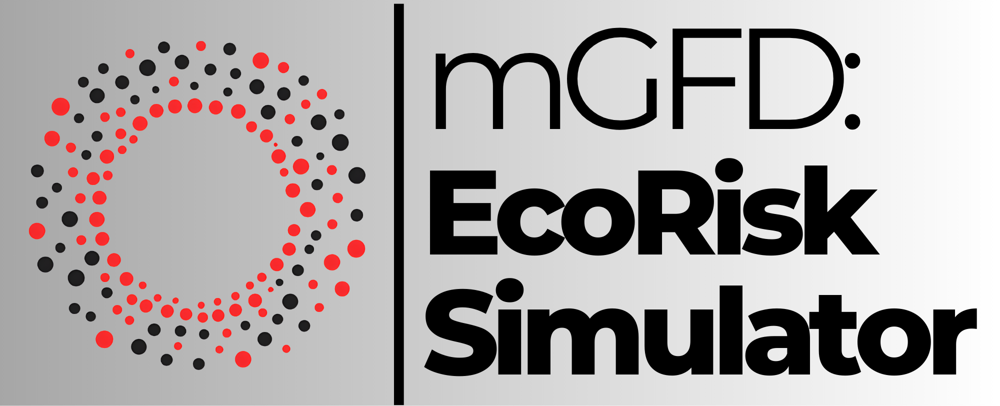

# mGFD EcoRisk Simulator :ocean:

<div align="center">



[](https://github.com/gstinoco/mGFD_EcoRisk_Simulator) [](https://www.python.org/downloads/) [](https://numpy.org/) [](https://pandas.pydata.org/) [](https://scipy.org/) [](https://scikit-learn.org/) [](https://matplotlib.org/) [](https://seaborn.pydata.org/) [](https://opensource.org/licenses/MIT)

**Hybrid methodology for numerical simulation and ecological risk classification**

*2D advection–diffusion model + machine learning to map risk zones (Low, Medium, High)*

### :link: Quick Links
[](#rocket-quick-start) [](#rocket-quick-start) [](#package-installation--setup) [](#books-mathematical-model) [](#file_cabinet-dataset-structure) [](#chart_with_upwards_trend-performance-benchmarks) [](#movie_camera-visualizations) [](#scientist-research-team) [](#handshake-contributing) [](#factory-industry-partners-supporting-innovation) [](#pray-acknowledgments)

</div>

---

## :clipboard: Table of Contents
- [Overview](#star2-overview)
- [Features](#sparkles-features)
- [Installation & Setup](#package-installation--setup)
- [Quick Start](#rocket-quick-start)
- [Usage Guide](#book-usage-guide)
- [Visualizations](#movie_camera-visualizations)
- [API Documentation](#gear-api-documentation)
- [Data Formats](#file_cabinet-data-formats)
- [Project Architecture](#open_file_folder-project-architecture)
- [Mathematical Model](#books-mathematical-model)
- [Dataset Structure](#file_cabinet-dataset-structure)
- [Performance Benchmarks](#chart_with_upwards_trend-performance-benchmarks)
- [Contributing](#handshake-contributing)
- [Research Team](#scientist-research-team)
- [Industry Partners Supporting Innovation](#factory-industry-partners-supporting-innovation)
- [Scientific References](#books-scientific-references)
- [Citation & License](#memo-citation--license)
- [Acknowledgments](#pray-acknowledgments)
- [Contact](#email-contact--support)
- [FAQ](#speech_balloon-faq)

---

## :star2: Overview

This repository implements a **hybrid methodology** to assess **ecological risk** associated with contaminants in water bodies (e.g., rivers and channels), integrating:

- **Numerical simulation** of transport (2D **advection–diffusion** model with decay) to generate concentration fields over the domain.
- **Feature engineering** from results (spatial, temporal, and hydrodynamic).
- **Machine learning** to **classify risk** into three levels: **Low (0), Medium (1), High (2)**.
- **Visualizations** (maps, confusion matrices, feature importance, and metrics dashboards).
- **Scenario-based execution** to build diverse and reproducible datasets.

### :wrench: Key capabilities
- **:abacus: Numerical model**: explicit finite-difference scheme with stability checks (CFL and diffusion).
- **:microscope: Scenarios**: multiple predefined scenarios (velocities/discharges and source positions) configurable via YAML.
- **:robot: Risk classification**: Random Forest, SVM, Gradient Boosting, Logistic Regression; cross-validation and hyperparameter tuning.
- **:art: Reports and plots**: comparative dashboards, detailed confusion matrices, and feature-importance ranking.
- **:floppy_disk: Export**: outputs in NPY and CSV for interoperability (Excel/R/MATLAB/Python).

---

## :sparkles: Features

### :abacus: Numerical simulation (contaminant transport)
- Solves the 2D advection–diffusion equation with first-order decay.
- Supports **Dirichlet**, **Neumann**, and **mixed** boundary conditions.
- Models sources with configurable location, intensity, and duration.
- Stores time history and final state for analysis and training.

### :robot: Machine learning (risk classifier)
- Supports multiple algorithms and selects the best via cross-validation.
- Hyperparameter tuning with GridSearchCV.
- Two feature sets:
  - **Fundamental (8)**: base parameters (source, velocities, position, normalized time).
  - **Complete (16)**: fundamental + derived variables (distances, travel times, Péclet numbers, etc.).

### :movie_camera: Visualization and analysis
- GIFs and snapshots for spatio-temporal evolution of concentration and risk.
- Model comparison plots and metrics dashboards.
- Confusion matrix (absolute and normalized) for detailed inspection.

---

## :package: Installation & Setup

### :computer: System requirements

| Component | Minimum | Recommended |
|-----------|--------|-------------|
| **Python** | 3.8+ | 3.9+ |
| **RAM** | 8 GB | 16 GB+ (if exporting full history) |
| **CPU** | 4 cores | 8+ cores |
| **Storage** | 2 GB | 10 GB+ (datasets + results) |
| **OS** | Windows/Linux/macOS | Linux (better for large batches) |

### :clipboard: Dependencies

```python
# Scientific computing
numpy>=1.21.0
pandas>=1.3.0
scipy>=1.7.0

# Machine learning
scikit-learn>=1.0.0
joblib>=1.1.0

# Visualization
matplotlib>=3.5.0
seaborn>=0.11.0

# Utilities
PyYAML>=6.0
tqdm>=4.62.0
```

### Quick Installation

```bash
# Method 1: direct install
git clone https://github.com/gstinoco/mGFD_EcoRisk_Simulator.git
cd mGFD_EcoRisk_Simulator
pip install -r requirements.txt

# Method 2: virtual environment (recommended)
python -m venv contaminant_env
source contaminant_env/bin/activate  # Windows: contaminant_env\Scripts\activate
pip install -r requirements.txt
```

### :white_check_mark: Quick sanity check

```bash
python -c "import numpy, pandas, sklearn, matplotlib, seaborn, yaml; print(':white_check_mark: OK')"
python main.py --help
```

---

## :rocket: Quick Start

<table>
  <thead>
    <tr>
      <th align="left" width="170">Step</th>
      <th align="left">What to do</th>
    </tr>
  </thead>
  <tbody>
    <tr>
      <td><b>1) Install</b></td>
      <td>
        <pre><code>pip install -r requirements.txt</code></pre>
      </td>
    </tr>
    <tr>
      <td><b>2) Run</b></td>
      <td>
        <pre><code>python main.py --complete</code></pre>
      </td>
    </tr>
    <tr>
      <td><b>3) Check outputs</b></td>
      <td>
        <b>Simulations:</b> <code>data/simulations/</code><br/>
        <b>Dataset:</b> <code>data/processed/</code><br/>
        <b>Metrics / model:</b> <code>data/results/</code><br/>
        <b>Visualizations:</b> <code>data/visualizations/</code> (or <code>docs/</code> for demos)
      </td>
    </tr>
  </tbody>
</table>

### :zap: Typical flows (CLI)

```bash
# Full pipeline (complete features = default)
python main.py --complete

# Full pipeline using only fundamental features (8)
python main.py --complete --fundamental-features

# Simulate a specific scenario
python main.py --simulate --scenario baseline_left_center

# Simulate all scenarios defined in config/parameters.yaml
python main.py --simulate --all-scenarios

# Preprocess, train, and visualize (separately)
python main.py --preprocess
python main.py --train
python main.py --visualize

# Generate GIFs and snapshots
python main.py --create-videos
python main.py --create-snapshots --snapshots-count 6
```

---

## :book: Usage Guide

<div align="center">

*Practical workflows for simulation, preprocessing, training, and visual analysis*

</div>

### :abacus: Simulation (YAML → concentration fields)

<table>
  <thead>
    <tr>
      <th align="left" width="170">Step</th>
      <th align="left">What it does</th>
    </tr>
  </thead>
  <tbody>
    <tr>
      <td><b>1) Configure</b></td>
      <td>Edit <code>config/parameters.yaml</code> (domain, physics, source, boundaries, scenarios).</td>
    </tr>
    <tr>
      <td><b>2) Run</b></td>
      <td><pre><code>python main.py --simulate --scenario baseline_lower</code></pre></td>
    </tr>
    <tr>
      <td><b>3) Outputs</b></td>
      <td>NPY/CSV are saved to <code>data/simulations/&lt;scenario&gt;/</code>.</td>
    </tr>
  </tbody>
</table>

### :factory: Scenario-based generation (synthetic dataset)

<table>
  <thead>
    <tr>
      <th align="left" width="170">Step</th>
      <th align="left">What it does</th>
    </tr>
  </thead>
  <tbody>
    <tr>
      <td><b>1) Run batch</b></td>
      <td><pre><code>python main.py --simulate --all-scenarios</code></pre></td>
    </tr>
    <tr>
      <td><b>2) Dataset</b></td>
      <td>Scenarios create diversity (source position, flow/discharge).</td>
    </tr>
  </tbody>
</table>

### :gear: Preprocessing (simulations → feature matrix)

<table>
  <thead>
    <tr>
      <th align="left" width="170">Step</th>
      <th align="left">What it does</th>
    </tr>
  </thead>
  <tbody>
    <tr>
      <td><b>1) Run</b></td>
      <td>
        <pre><code>python main.py --preprocess</code></pre>
        <pre><code>python main.py --preprocess --fundamental-features</code></pre>
      </td>
    </tr>
    <tr>
      <td><b>2) Outputs</b></td>
      <td>
        <code>data/processed/X_train_*.npy</code>, <code>X_test_*.npy</code>, <code>y_train_*.npy</code>, <code>y_test_*.npy</code><br/>
        and <code>feature_names_*.txt</code>
      </td>
    </tr>
  </tbody>
</table>

### :robot: Training (features → risk model)

<table>
  <thead>
    <tr>
      <th align="left" width="170">Step</th>
      <th align="left">What it does</th>
    </tr>
  </thead>
  <tbody>
    <tr>
      <td><b>1) Train</b></td>
      <td>
        <pre><code>python main.py --train</code></pre>
        <pre><code>python main.py --train --fundamental-features</code></pre>
      </td>
    </tr>
    <tr>
      <td><b>2) Evaluation</b></td>
      <td>Computes per-model metrics and saves the best classifier.</td>
    </tr>
    <tr>
      <td><b>3) Outputs</b></td>
      <td><code>data/results/</code> (metrics CSV and classifier PKL).</td>
    </tr>
  </tbody>
</table>

### :art: Visualization (results → plots and dashboards)

<table>
  <thead>
    <tr>
      <th align="left" width="170">Step</th>
      <th align="left">What it does</th>
    </tr>
  </thead>
  <tbody>
    <tr>
      <td><b>1) Visualize</b></td>
      <td>
        <pre><code>python main.py --visualize</code></pre>
        <pre><code>python main.py --visualize --fundamental-features</code></pre>
      </td>
    </tr>
    <tr>
      <td><b>2) Outputs</b></td>
      <td><code>data/visualizations/</code> with PNGs (model comparison, confusion matrix, feature importance, dashboard).</td>
    </tr>
  </tbody>
</table>

---

## :movie_camera: Visualizations

### :framed_picture: Demos (GIF)

<div align="center">

**Contaminant evolution (concentration)**


**Ecological risk evolution**


</div>

### :bar_chart: Dashboards & metrics (PNG)

<div align="center">


</div>

### :camera_flash: Snapshots (example)

<div align="center">


</div>

---

---

## :gear: API Documentation

This project is primarily used as a command-line tool (CLI) via `main.py`.

| Entry point | Command | Purpose |
|------------|---------|-----------|
| `main.py` | `python main.py --complete` | Runs the full flow (simulation → dataset → training → visualization) |
| `main.py` | `python main.py --simulate [--scenario <name> | --all-scenarios]` | Runs numerical simulations |
| `main.py` | `python main.py --preprocess [--fundamental-features]` | Builds the ML dataset |
| `main.py` | `python main.py --train [--fundamental-features]` | Trains models and saves the best one |
| `main.py` | `python main.py --visualize [--fundamental-features]` | Generates plots/dashboards from results |
| `main.py` | `python main.py --create-videos` | Generates time-evolution GIFs |
| `main.py` | `python main.py --create-snapshots --snapshots-count N` | Generates snapshots at selected times |

For full help:

```bash
python main.py --help
```

---

## :file_cabinet: Data Formats

### :floppy_disk: Simulation (NPY / CSV)

Each scenario stores (at minimum) the following in `data/simulations/<scenario>/`:

- `final_concentration.npy`: final field `C(x,y,t_final)`
- `concentration_history.npy`: time history (can be large)
- `x_coordinates.npy`, `y_coordinates.npy`: spatial axes
- `times.npy`: time vector
- `parameters.yaml`: effective parameters used (base + scenario overrides)

If `output.export_csv: true` in `config/parameters.yaml`, it also exports:

- `final_concentration.csv`
- `coordinates.csv`
- `times.csv`
- `concentration_history.csv` (only if `output.csv_include_history: true`, can be very large)

### :robot: ML dataset (NPY)

In `data/processed/` it stores (with compatibility suffixes):

- Complete features (16): `*_complete.npy` and `feature_names_complete.txt`
- Fundamental features (8): `*_fundamental.npy` and `feature_names_fundamental.txt`

Targets:
- `y_*`: risk labels `0/1/2` for (Low/Medium/High).

---

## :open_file_folder: Project Architecture

```text
.
├─ config/
│  └─ parameters.yaml           # Model, ML, visualization, and scenario parameters
├─ data/
│  ├─ simulations/              # Per-scenario outputs (NPY/CSV + parameters)
│  ├─ processed/                # ML matrices (X/y + feature names)
│  └─ results/                  # Metrics and trained models (CSV/PKL)
├─ docs/
│  ├─ images/                   # Dashboards and snapshots
│  ├─ videos/                   # Concentration and risk GIFs
│  └─ logo/                     # Logos
├─ src/
│  ├─ numerical_model/          # Advection–diffusion equation (FD)
│  ├─ ml_model/                 # Preprocessing and risk classifier
│  └─ visualization/            # Plots, dashboards, GIFs and snapshots
└─ main.py                      # CLI and full-flow orchestration
```

Core components:
- `src/numerical_model/advection_diffusion.py`: 2D transport solver.
- `src/ml_model/data_preprocessing.py`: feature extraction + risk labels.
- `src/ml_model/risk_classifier.py`: model training/evaluation/persistence.
- `src/visualization/visualization.py`: visualization and export.

---

## :books: Mathematical Model

### :books: Governing equation

Contaminant transport is modeled with the 2D advection–diffusion equation with decay:

$$
    \frac{\partial C}{\partial t} = u \frac{\partial C}{\partial x} + v \frac{\partial C}{\partial y} + D \left( \frac{\partial^2 C}{\partial x^2} + \frac{\partial^2 C}{\partial y^2} \right) + S - k C
$$

Where:
- `C`: contaminant concentration [mg/L]
- `u, v`: advection velocities [m/s]
- `D`: diffusion coefficient [m²/s]
- `S`: source (injection) [mg/(L·s)]
- `k`: decay rate [1/s]

### :triangular_flag_on_post: Boundary conditions

Configurable in `config/parameters.yaml` as:
- **Dirichlet**: fixed concentration at the boundary.
- **Neumann**: fixed gradient/flux (open outflow).
- **Mixed**: per-side combination.

### :warning: Numerical stability (explicit scheme)

The solver prints typical checks:
- CFL condition for advection.
- Stability condition for diffusion.

If violated, adjust `dt`, `dx`, `dy`, or physical parameters in the configuration.

---

## :file_cabinet: Dataset Structure

This project can operate as:
- A **dataset generator** (scenario-driven) from simulations.
- An **ML pipeline** for risk classification using previously generated datasets.

Main layout:

```text
data/
├─ simulations/
│  ├─ baseline_left_center/
│  ├─ baseline_lower/
│  └─ baseline_upper/
├─ processed/
│  ├─ X_train_complete.npy
│  ├─ X_test_complete.npy
│  ├─ y_train_complete.npy
│  ├─ y_test_complete.npy
│  ├─ feature_names_complete.txt
│  ├─ X_train_fundamental.npy
│  ├─ X_test_fundamental.npy
│  ├─ y_train_fundamental.npy
│  ├─ y_test_fundamental.npy
│  └─ feature_names_fundamental.txt
└─ results/
   ├─ all_models_metrics_report.csv
   ├─ all_models_metrics_report (fundamental features).csv
   ├─ risk_classifier_model.pkl
   └─ risk_classifier_model (fundamental features).pkl
```

---

## :chart_with_upwards_trend: Performance Benchmarks

### :trophy: Reported metrics (example)

Reference results (files in `data/results/`):

| Feature set | Best model (Accuracy) | File |
|---|---:|---|
| **Complete (16)** | GradientBoosting (**0.9997**) | `all_models_metrics_report.csv` |
| **Fundamental (8)** | GradientBoosting (**0.9893**) | `all_models_metrics_report (fundamental features).csv` |

> Note: Results depend on configuration, sampling, and the available scenarios.

---

## :handshake: Contributing

<div align="center">

### :star2: Contribute to the Project
*Bug reports, feature requests, and pull requests are welcome*

[](https://github.com/gstinoco/mGFD_EcoRisk_Simulator/issues)
[](https://github.com/gstinoco/mGFD_EcoRisk_Simulator/pulls)

</div>

### :bug: Bug Reports
1. **Search existing issues**: Check if the bug has already been reported
2. **Create a detailed report**: Include steps to reproduce and expected vs actual behavior
3. **Provide context**: Operating system, Python version, executed command, scenario name, and relevant configuration parameters

### :bulb: Feature Requests
1. **Describe the feature**: Clear and concise description of the proposed functionality
2. **Justify the need**: Explain how it benefits research, reproducibility, or usability
3. **Provide examples**: Use cases, expected inputs/outputs, and acceptance criteria

### :computer: Code Contributions

```bash
git clone https://github.com/gstinoco/mGFD_EcoRisk_Simulator.git
cd mGFD_EcoRisk_Simulator

python -m venv dev_env
source dev_env/bin/activate  # On Windows: dev_env\Scripts\activate
pip install -r requirements.txt

git checkout -b feature/your-feature-name
```

---

## :scientist: Research Team

<div align="center">

### :star2: Meet the Team
*Researchers and graduate students advancing meshless computational methods*

</div>

### :busts_in_silhouette: Main Researchers

<table align="center">
  <thead>
    <tr>
      <th align="center" width="120">Photo</th>
      <th align="left">Researcher</th>
      <th align="left">Affiliation</th>
      <th align="left">Contact</th>
    </tr>
  </thead>
  <tbody>
    <tr>
      <td align="center" width="120">
        
      </td>
      <td>
        <b>Dr. Gerardo Tinoco Guerrero</b> :mexico:<br/>
        <sub>Numerical Methods &amp; Computational Mathematics</sub>
      </td>
      <td>
        <a href="http://www.siiia.com.mx"></a><br/>
        <a href="http://www.umich.mx"></a>
      </td>
      <td>
        <a href="mailto:gerardo.tinoco@umich.mx"></a><br/>
        <a href="https://orcid.org/0000-0003-3119-770X"></a><br/>
        <a href="https://www.researchgate.net/profile/Gerardo-Tinoco-Guerrero"></a>
      </td>
    </tr>
    <tr>
      <td align="center" width="120">
        
      </td>
      <td>
        <b>Dr. Francisco Javier Domínguez Mota</b> :mexico:<br/>
        <sub>Applied Mathematics &amp; Finite Difference Methods</sub>
      </td>
      <td>
        <a href="http://www.siiia.com.mx"></a><br/>
        <a href="http://www.umich.mx"></a>
      </td>
      <td>
        <a href="mailto:francisco.mota@umich.mx"></a><br/>
        <a href="https://orcid.org/0000-0001-6837-172X"></a><br/>
        <a href="https://www.researchgate.net/profile/Francisco-Dominguez-Mota"></a>
      </td>
    </tr>
    <tr>
      <td align="center" width="120">
        
      </td>
      <td>
        <b>Dr. José Alberto Guzmán Torres</b> :mexico:<br/>
        <sub>Engineering Applications &amp; Artificial Intelligence</sub>
      </td>
      <td>
        <a href="http://www.siiia.com.mx"></a><br/>
        <a href="http://www.umich.mx"></a>
      </td>
      <td>
        <a href="mailto:jose.alberto.guzman@umich.mx"></a><br/>
        <a href="https://orcid.org/0000-0002-9309-9390"></a><br/>
        <a href="https://www.researchgate.net/profile/Jose-Guzman-Torres"></a>
      </td>
    </tr>
    <tr>
      <td align="center" width="120">
        
      </td>
      <td>
        <b>Dr. Heriberto Árias Rojas</b> :mexico:<br/>
        <sub>Engineering Applications</sub>
      </td>
      <td>
        <a href="http://www.siiia.com.mx"></a><br/>
        <a href="http://www.umich.mx"></a>
      </td>
      <td>
        <a href="mailto:heriberto.arias@umich.mx"></a><br/>
        <a href="https://orcid.org/0000-0002-7641-8310"></a><br/>
        <a href="https://www.researchgate.net/profile/Heriberto-Arias-Rojas"></a>
      </td>
    </tr>
  </tbody>
</table>

### :mortar_board: Ph.D. Research Students

<table align="center">
  <thead>
    <tr>
      <th align="center" width="120">Photo</th>
      <th align="left">Student</th>
      <th align="left">Institution</th>
      <th align="left">Contact</th>
    </tr>
  </thead>
  <tbody>
    <tr>
      <td align="center" width="120">
        
      </td>
      <td>
        <b>Gabriela Pedraza-Jiménez</b><br/>
        
      </td>
      <td>
        <a href="http://www.umich.mx"></a>
      </td>
      <td>
        <a href="mailto:2220157h@umich.mx"></a>
      </td>
    </tr>
    <tr>
      <td align="center" width="120">
        
      </td>
      <td>
        <b>Eli Chagolla-Inzunza</b><br/>
        
      </td>
      <td>
        <a href="http://www.umich.mx"></a>
      </td>
      <td>
        <a href="mailto:1137626b@umich.mx"></a>
      </td>
    </tr>
  </tbody>
</table>

### :mortar_board: M.Sc. Research Students

<table align="center">
  <thead>
    <tr>
      <th align="center" width="120">Photo</th>
      <th align="left">Student</th>
      <th align="left">Institution</th>
      <th align="left">Contact</th>
    </tr>
  </thead>
  <tbody>
    <tr>
      <td align="center" width="120">
        
      </td>
      <td>
        <b>Jorge L. González-Figueroa</b><br/>
        
      </td>
      <td>
        <a href="http://www.umich.mx"></a>
      </td>
      <td>
        <a href="mailto:1718717h@umich.mx"></a>
      </td>
    </tr>
    <tr>
      <td align="center" width="120">
        
      </td>
      <td>
        <b>Christopher N. Magaña-Barocio</b><br/>
        
      </td>
      <td>
        <a href="http://www.umich.mx"></a>
      </td>
      <td>
        <a href="mailto:1339846k@umich.mx"></a>
      </td>
    </tr>
  </tbody>
</table>

### :mortar_board: Undergraduate Research Students

<table align="center">
  <thead>
    <tr>
      <th align="center" width="120">Photo</th>
      <th align="left">Student</th>
      <th align="left">Institution</th>
      <th align="left">Contact</th>
    </tr>
  </thead>
  <tbody>
    <tr>
      <td align="center" width="120">
        
      </td>
      <td>
        <b>Maria Goretti Fraga-Lopez</b><br/>
        
      </td>
      <td>
        <a href="http://www.umich.mx"></a>
      </td>
      <td>
        <a href="mailto:1702174b@umich.mx"></a>
      </td>
    </tr>
  </tbody>
</table>

---

## :factory: Industry Partners Supporting Innovation

<div align="center">

### :star2: Industry Partners Supporting Innovation
*Collaboration between academia and industry to accelerate real-world impact*

</div>

<div align="center">

<table align="center" width="70%">
<tr>
<td align="center">

### :factory: **SIIIA MATH**
#### *Soluciones de Ingeniería, México*

<div align="center">

[](http://www.siiia.com.mx)
[](http://www.siiia.com.mx)
[](http://www.siiia.com.mx)

</div>

**🎯 Focus areas:**
- Mathematical modeling & simulation
- AI/ML engineering solutions
- Technology transfer and applied R&amp;D

<div align="center">

[](mailto:gtinoco@siiia.com.mx)

</div>

</td>
</tr>
</table>

</div>

---

## :books: Scientific References

### :books: Core Publications (GFD / mGFD Background)

1. **Tinoco-Guerrero, G.**, Domínguez-Mota, F. J., Guzmán-Torres, J. A., & Tinoco-Ruiz, J. G. (2022). *"Numerical Solution of Diffusion Equation using a Method of Lines and Generalized Finite Differences."* **Revista Internacional de Métodos Numéricos para Cálculo y Diseño en Ingeniería**, 38(2). [DOI: 10.23967/j.rimni.2022.06.003](http://dx.doi.org/10.23967/j.rimni.2022.06.003)

### :trophy: Project Highlights

- **Scenario-driven simulation**: predefined combinations of flow, discharge, and source position for reproducible experiments
- **Hybrid workflow**: concentration fields are transformed into feature matrices for ecological risk classification
- **Decision-support outputs**: per-scenario histories, trained models, comparative metrics, and risk visualizations

---

## :memo: Citation & License

If you use this software in your research, please cite:

```bibtex
@software{tinoco2025mgfd_ecorisk_simulator,
  title={mGFD EcoRisk Simulator: Hybrid methodology for numerical simulation and ecological risk classification},
  author={Tinoco-Guerrero, Gerardo and 
          Domínguez-Mota, Francisco Javier and 
          Guzmán-Torres, José Alberto and
          Arias-Rojas, Heriberto},
  year={2025},
  institution={Universidad Michoacana de San Nicolás de Hidalgo},
  organization={SIIIA MATH: Soluciones en ingeniería},
  url={https://github.com/gstinoco/mGFD_EcoRisk_Simulator},
  note={Software repository for 2D advection-diffusion simulation, scenario-based dataset generation, and machine-learning-based ecological risk classification in water bodies}
}
```

### :page_facing_up: License

This project is licensed under the **MIT License** - see the full license text below:

```
MIT License

Copyright (c) 2025 Gerardo Tinoco-Guerrero, Francisco Javier Domínguez-Mota, 
                   José Alberto Guzmán-Torres, Heriberto Árias Rojas

Permission is hereby granted, free of charge, to any person obtaining a copy
of this software and associated documentation files (the "Software"), to deal
in the Software without restriction, including without limitation the rights
to use, copy, modify, merge, publish, distribute, sublicense, and/or sell
copies of the Software, and to permit persons to whom the Software is
furnished to do so, subject to the following conditions:

The above copyright notice and this permission notice shall be included in all
copies or substantial portions of the Software.

THE SOFTWARE IS PROVIDED "AS IS", WITHOUT WARRANTY OF ANY KIND, EXPRESS OR
IMPLIED, INCLUDING BUT NOT LIMITED TO THE WARRANTIES OF MERCHANTABILITY,
FITNESS FOR A PARTICULAR PURPOSE AND NONINFRINGEMENT. IN NO EVENT SHALL THE
AUTHORS OR COPYRIGHT HOLDERS BE LIABLE FOR ANY CLAIM, DAMAGES OR OTHER
LIABILITY, WHETHER IN AN ACTION OF CONTRACT, TORT OR OTHERWISE, ARISING FROM,
OUT OF OR IN CONNECTION WITH THE SOFTWARE OR THE USE OR OTHER DEALINGS IN THE
SOFTWARE.
```

**Academic Use:** This software is developed for research and educational purposes. Commercial use is permitted under the MIT License terms.

---

## :pray: Acknowledgments

<div align="center">

### :heart: Special Thanks
*We extend our gratitude to the institutions and partners supporting this research and open-source development*

</div>

### :classical_building: Institutional Support

<table align="center" width="100%" cellspacing="14">
  <tr>
    <td width="50%" valign="top">
      <div style="border: 1px solid #d0d7de; border-radius: 12px; padding: 16px;">
        <div align="center">
          <b>🎓 Universidad Michoacana de San Nicolás de Hidalgo (UMSNH)</b><br/>
          <sub>Academic institution, Mexico</sub><br/><br/>
          <a href="http://www.umich.mx"></a>
          
          
        </div>
        <br/>
        <b>Key support</b>
        <ul>
          <li>Academic foundation and research infrastructure</li>
          <li>Scientific training and supervision environment</li>
        </ul>
      </div>
    </td>
    <td width="50%" valign="top">
      <div style="border: 1px solid #d0d7de; border-radius: 12px; padding: 16px;">
        <div align="center">
          <b>🏛️ Secretariat of Science, Humanities, Technology and Innovation(SECIHTI)</b><br/>
          <sub> State Secretariat, Mexico</sub><br/><br/>
          <a href="https://secihti.mx/"></a>
          
          
        </div>
        <br/>
        <b>Key support</b>
        <ul>
          <li>Support for science and technology initiatives</li>
          <li>Funding and innovation promotion</li>
        </ul>
      </div>
    </td>
  </tr>
  <tr>
    <td width="50%" valign="top">
      <div style="border: 1px solid #d0d7de; border-radius: 12px; padding: 16px;">
        <div align="center">
          <b>🌿 Centre Internacional de Mètodes Numèrics en Enginyeria (CIMNE)</b><br/>
          <sub>Industry, Spain</sub><br/><br/>
          <a href="https://aulas.cimne.com/aula/aula-morelia/"></a>
          
          
        </div>
        <br/>
        <b>Key support</b>
        <ul>
          <li>International collaboration in numerical methods</li>
          <li>Computational engineering research environment</li>
        </ul>
      </div>
    </td>
    <td width="50%" valign="top">
      <div style="border: 1px solid #d0d7de; border-radius: 12px; padding: 16px;">
        <div align="center">
          <b>🏭 SIIIA MATH: Soluciones en Ingeniería</b><br/>
          <sub>Industry, México</sub><br/><br/>
          <a href="http://www.siiia.com.mx"></a>
          
          
        </div>
        <br/>
        <b>Key support</b>
        <ul>
          <li>Industry-driven applied research and development</li>
          <li>Technology transfer and practical engineering impact</li>
        </ul>
      </div>
    </td>
  </tr>
</table>

### :building_with_garden: Research Centers & Collaborations

<div align="center">

<table align="center" width="100%" cellspacing="14">
  <tr>
    <td width="50%" valign="top">
      <div style="border: 1px solid #d0d7de; border-radius: 12px; padding: 16px;">
        <div align="center">
          <b>🌿 Aula CIMNE-Morelia</b><br/>
          <sub>Research collaboration space</sub><br/><br/>
          <a href="https://aulas.cimne.com/aula/aula-morelia/"></a>
          
          
        </div>
        <br/>
        <b>Collaboration highlights</b>
        <ul>
          <li>Numerical methods and computational engineering environment</li>
          <li>Academic–industry collaboration and training activities</li>
        </ul>
      </div>
    </td>
    <td width="50%" valign="top">
      <div style="border: 1px solid #d0d7de; border-radius: 12px; padding: 16px;">
        <div align="center">
          <b>🎓 UMSNH</b><br/>
          <sub>Academic collaboration</sub><br/><br/>
          <a href="http://www.umich.mx"></a>
          
          
        </div>
        <br/>
        <b>Collaboration highlights</b>
        <ul>
          <li>Institutional infrastructure supporting research and training</li>
          <li>Graduate formation and supervision for scientific computing</li>
        </ul>
      </div>
    </td>
  </tr>
</table>

</div>

### :computer: Technology Communities

<div align="center">

| :package: Framework | :busts_in_silhouette: Community | :star: Contribution |
|:---:|:---:|:---:|
| [](https://pandas.pydata.org/) | **Pandas Community** | Tabular preprocessing and dataset handling |
| [](https://numpy.org/) | **NumPy Community** | Array computing foundation |
| [](https://scipy.org/) | **SciPy Community** | Numerical algorithms |
| [](https://scikit-learn.org/) | **Scikit-learn Community** | Risk classification and model selection |
| [](https://matplotlib.org/) | **Matplotlib Community** | Scientific visualization |
| [](https://seaborn.pydata.org/) | **Seaborn Community** | Statistical graphics and model comparison |

</div>

---

## :email: Contact & Support

<div align="center">

*Contact channels, technical support, and collaboration opportunities*

[](https://github.com/gstinoco/mGFD_EcoRisk_Simulator/issues)
[](mailto:gerardo.tinoco@umich.mx)

</div>

<table align="center" width="100%" cellspacing="14">
  <tr>
    <td valign="top" style="border: 1px solid #d0d7de; border-radius: 12px; padding: 16px;">
      <div align="center">
        <b>Primary Contact</b><br/>
        <sub>Research group coordination</sub>
      </div>
      <br/>
      <b>Dr. Gerardo Tinoco Guerrero</b><br/>
      <sub>Morelia, Michoacán, México</sub>
      <br/><br/>
      <div align="center">
        <a href="mailto:gerardo.tinoco@umich.mx"></a>
        <a href="http://www.siiia.com.mx"></a>
        <a href="http://www.umich.mx"></a>
      </div>
    </td>
  </tr>
  <tr>
    <td valign="top" style="border: 1px solid #d0d7de; border-radius: 12px; padding: 16px;">
      <div align="center">
        <b>Technical Support</b><br/>
        <sub>Bug reports, questions, and collaboration requests</sub>
      </div>
      <br/>
      <div align="center">
        <a href="https://github.com/gstinoco/mGFD_EcoRisk_Simulator/issues"></a>
        <a href="mailto:gerardo.tinoco@umich.mx"></a>
        <a href="mailto:gerardo.tinoco@umich.mx?subject=mGFD%20EcoRisk%20Simulator%20Collaboration"></a>
      </div>
      <br/>
      <ul>
        <li><b>Issues</b> for bugs and feature requests</li>
        <li><b>Email</b> for technical inquiries</li>
        <li><b>Collaboration</b> for partnerships and joint projects</li>
      </ul>
    </td>
  </tr>
  <tr>
    <td valign="top" style="border: 1px solid #d0d7de; border-radius: 12px; padding: 16px;">
      <div align="center">
        <b>Collaboration Opportunities</b><br/>
        <sub>Research and engineering partnerships</sub>
      </div>
      <br/>
      <table width="100%">
        <tr>
          <td width="50%"><b>🧮 Numerical Methods</b><br/><sub>advection-diffusion solvers, stability criteria, and boundary-condition treatment</sub></td>
          <td width="50%"><b>🌿 Environmental Modeling</b><br/><sub>contaminant transport, decay processes, and scenario-based water-quality analysis</sub></td>
        </tr>
        <tr>
          <td width="50%"><b>🤖 Machine Learning</b><br/><sub>feature engineering, risk classification, and comparative model evaluation</sub></td>
          <td width="50%"><b>📊 Scientific Workflows</b><br/><sub>reproducible preprocessing, benchmarking, and visualization pipelines</sub></td>
        </tr>
        <tr>
          <td width="50%"><b>🌊 CFD / Water Quality</b><br/><sub>transport analysis, sensitivity studies, and ecological decision-support applications</sub></td>
          <td width="50%"></td>
        </tr>
      </table>
    </td>
  </tr>
  <tr>
    <td valign="top" style="border: 1px solid #d0d7de; border-radius: 12px; padding: 16px;">
      <div align="center">
        <b>Student Opportunities</b><br/>
        <sub>Projects and training in scientific computing</sub>
      </div>
      <br/>
      <ul>
        <li><b>Graduate Programs</b>: research opportunities with the team</li>
        <li><b>Undergraduate Projects</b>: thesis topics in computational engineering</li>
        <li><b>Internships</b>: scientific computing, numerical methods, and applied modeling</li>
      </ul>
    </td>
  </tr>
  <tr>
    <td valign="top" style="border: 1px solid #d0d7de; border-radius: 12px; padding: 16px;">
      <div align="center">
        <b>Institutional Affiliations</b>
      </div>
      <br/>
      <div align="center">
        <a href="http://www.siiia.com.mx"></a>
        <a href="http://www.umich.mx"></a>
        
      </div>
    </td>
  </tr>
</table>

---

## :speech_balloon: FAQ

<details>
  <summary><b>Which outputs are generated by the simulator?</b></summary>
  <br/>
  The project generates per-scenario simulation files (NPY/CSV), processed datasets, trained models, metrics reports, and visualization assets such as dashboards, snapshots, and GIFs.
</details>

<details>
  <summary><b>Where are outputs saved when running locally?</b></summary>
  <br/>
  Scenario outputs are written to <code>data/simulations/</code>, processed matrices to <code>data/processed/</code>, trained models and reports to <code>data/results/</code>, and figures/GIFs to <code>data/visualizations/</code> or <code>docs/</code>.
</details>

<details>
  <summary><b>How are risk labels assigned?</b></summary>
  <br/>
  Risk labels are derived from concentration thresholds defined in <code>config/parameters.yaml</code> under <code>risk_thresholds</code>. By default, the workflow maps concentrations to Low, Medium, and High ecological risk levels.
</details>

<details>
  <summary><b>Can I use this in commercial projects?</b></summary>
  <br/>
  Yes. The project is released under the MIT License.
</details>

<details>
  <summary><b>How should I cite this work?</b></summary>
  <br/>
  Use the BibTeX entry in the Citation section and the referenced DOI in Scientific References.
</details>

---

<div align="center">

*Advancing ecological risk modeling through open-source collaboration*

[](https://github.com/gstinoco/mGFD_EcoRisk_Simulator/stargazers) [](https://github.com/gstinoco/mGFD_EcoRisk_Simulator/network/members) [](https://github.com/gstinoco/mGFD_EcoRisk_Simulator/watchers)

<br/>

<b>If this project helps your research, please consider giving it a star.</b>

</div>
